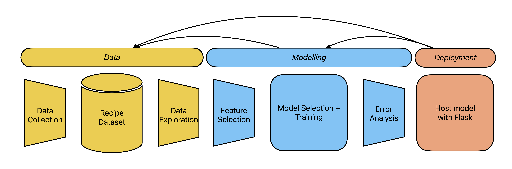

# TOMT
`TOMT` stands for "tip of my tongue". I am building this system because I often find myself running through a number of recipe sites trying to find something new to cook _depending on my mood_. Existing recipe recommendation systems (RSS) out don't really address my needs. Some recommend based on ingredient list, some even just suggest based solely on historic likes and dislikes. I want TOMT to recommend me recipes from _my trusted sources_ and learn my palette over time.

## Scope
Create a system that recommends recipes based on user filters (e.g., by meal, by cuisine, by method, by diet), profile, similar users. It should have a centralized interface that pulls data from my go-to sources and allows me to narrow down my choices to suggest a few recipes (~6) for me to choose from. I am picky about the quality of the recipes, so data collection is done in-house for greater control over where they are from and what features to include. The system should learn the flavour profile of the user such that suggestions get better over time (measured by like-dislike ratio over time). To do this, a rating feature needs to be implemented. 

## Project Cycle Overview


## To-do
- [x] Literature review on recommender systems
- [x] Outline project scope
- [x] Scrape recipes from seriouseats.com for prototyping
- [ ] Data exploration
- [ ] Build an MVP
- [ ] Refine scope and data collection
- [ ] Acquire recipe images and increase feature set (e.g., cooking time)
- [ ] Model selection
- [ ] Model development
- [ ] Error analysis -> data and model tuning
- [ ] Deploy model using flask
- [ ] Monitor deployment
- [ ] Refine pipeline


## Data
I have a few tried-and-true recipe sites that I often visit. I want control over where I pull my data from, what data to pull from each recipe and am scraping data my own data.

Recipe sites:
- https://seriouseats.com
- https://cooking.nytimes.com (requires paid subscription; add filtering option for user to suppress NYTC recipes)
- https://www.maangchi.com
- https://www.justonecookbook.com

## Files
```
.
├── data                     	# scraped raw-ish recipe data
│   └── ...       
│
├── eda                     	# code for exploratory data analysis of scraped data
│   └── serious_eats_eda.ipynb 	# find trends, get a better feel for the data, and further refine them
│
├── image                       # images for readme.md and project
│   └── ...
│
├── scrape                      # cod for scraping from my recipe sites
│   └── serious_eats.ipynb      # messing around with web scraping and generating .pkl datasets
│   └── serious_eats.py        	# class for scraping serious eats recipes
└── ...
```


## Tech Stack
Web scraping:
- requests, beautifulsoup, extruct

Data wrangling:
- pandas, numpy, matplotlib, seaborn

Model:
- scikit-learn, [lightfm](https://github.com/lyst/lightfm), [spotlight](https://github.com/maciejkula/spotlight)
- Content-based filtering (cosine similarity)
- Collaborative-based filtering (matrix factorization)

Web framework:
- flask


## Models
To solve the system cold start problem, I will use a hybrid approach by combining:
1. Content-based filtering
	- Suggest recipes that are similar to recipes previously liked by user
	- Implementation will be akin to setting up a new Apple Music profile, by providing users a bunch of recipe titles and ask them to select N recipes that they like

2. Collaborative filtering
	- Suggest recipes liked by other users with similar profile


